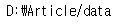

# How to Crawl Image from Google by using icrawler?

In order to learn an image model, a variety of images must be obtained.  
But downloading images by hand is too hard and troublesome.  
There are a variety of crawling methods to solve this problem, and today I'm going to introduce you to how to use an icrawler.  

*urls: https://icrawler.readthedocs.io/en/latest/builtin.html*

### 1. Confirm Current Work Directory
```python
import os

work_dir = os.getcwd()
print(work_dir)
```
**results**  


### 2. Make Data Directory
```python
try:
    os.chdir(work_dir)
    
    # make directory by mkdir cmd
    os.mkdir('./data')
    
except Exception as err:
    # error occurs if there are already data folder exists
    print(err)

data_dir = work_dir + '/data'

print(data_dir)
```
**results**  


**If exception occurs**  


### 3. Make Parent Directory
```python
try:
    os.chdir(data_dir)
    parent_dirname = input("Input Parent Directory name: ")
    os.mkdir(parent_dirname)

except Exception as err:
    # directory exists
    if os.path.exists(work_dir):
        print("\"" + parent_dirname + "\"" , "directory already exists in : ", os.getcwd())
        
    else:
        print("Wrong Directory path!")
        print("Current Directory path: ", os.getcwd())
```

### 4. Input Keyword to Download
### keyword: A, B, C, D, ...
``` python
from icrawler.builtin import GoogleImageCrawler
import os

# input keywords
search_words = input("Input Keyword to Download: ")

# replace "," to ""
if "," in search_words:
    search_words = search_words.replace(',', '')
    
search_list = search_words.split()
print(search_list)
```

### 5. Select Parameters(Download Limits, size, etc), Download Images
```python
# input max_limits
max_limits = int(input("Max Crawling Limit: "))

# save dir
save_dir = parent_dirname

# default size
size_opt = ">640x480"

# create save directory
curr_dir = os.getcwd()

if not os.path.exists(save_dir):
    os.mkdir(save_dir)

os.chdir(save_dir)
parent_dir = os.getcwd()

print("Current Directory: {}".format(parent_dir))

for img_dir in search_list:
    if not os.path.exists(img_dir) :
        os.mkdir(img_dir)
        
    os.chdir(parent_dir)
    
    google_crawler = GoogleImageCrawler( 
        feeder_threads = 1,
        parser_threads = 2, 
        downloader_threads = 4,
        storage = {'root_dir': parent_dir + "/" + img_dir})
    filters = dict(
        size = size_opt)
    google_crawler.session.verify = False
    google_crawler.crawl(keyword = img_dir, filters = filters, max_num = max_limits, file_idx_offset = 0)
    
    print("keyword {} {} images have been saved.".format(img_dir, max_limits))
    
# restore to original directory
os.chdir(curr_dir)
```

### 6. Set Image Directory
```python
img_dir = data_dir + '/' + parent_dirname
print(img_dir)
```

### 7. Make all of the Images to jpeg format
```python
from PIL import Image

img_ext_list = [".jpg", ".JPG", ".gif", ".GIF", ".png", ".PNG", ".jpeg", ".JPEG"]

def verify_image(img_file):
    try:
        v_image = Image.open(img_file)
        v_image.verify()
        v_image.close()
        
        return True
    except OSError:
        return False
    
for root, dirs, files in os.walk(img_dir):
    cnt = 1
    for file in files:
        currentFile = os.path.join(root, file)
        
        file, ext = os.path.splitext(currentFile)
        
        if ext in img_ext_list:
            ext = '.jpeg'
            
            if verify_image(currentFile):
                new_file_name = os.path.dirname(currentFile)
                try:
                    final_dir = os.path.dirname(currentFile) + "/"
                    new_file_name = final_dir + os.path.basename(os.path.dirname(currentFile)) + str(cnt) + ext
                    os.rename(currentFile, new_file_name)
                    
                    cnt += 1
                    print("file saved: ", new_file_name, "\n")
                    
                except Exception as err:
                    print(err)
```

### 8. Directory List
```python
dir_list = os.listdir(img_dir)

final_dir_list = []

for dirname in dir_list:
    final_dir_list.append(img_dir + '/' + dirname)
    
for dirname in final_dir_list:
    print(dirname)
```

### 9. Check Images
```python
import tensorflow as tf
import glob

for dirname in final_dir_list:
    for i, image_name in enumerate(glob.glob(os.path.join(dirname, '*.jpeg'))):
        print(i, image_name)
        
        with tf.Graph().as_default():
            image_contents = tf.read_file(image_name)
            image = tf.image.decode_jpeg(image_contents, channels = 3)
            
            with tf.Session() as sess:
                try:
                    sess.run(tf.global_variables_initializer())
                    tmp = sess.run(image)
                    
                except Exception as err:
                    print("[illegal file: ]", image_name, " will be removed.\n")
                    os.remove(image_name)
```
